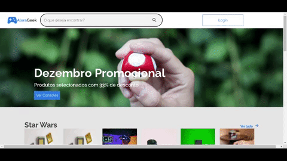
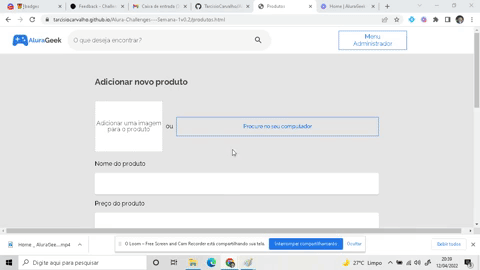
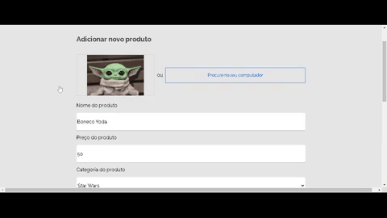
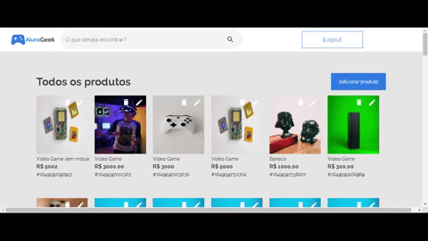

<h1 align = center> Alura-Challenges---AluraGeek
<h1>
    

        
    

</h1>

[Link Para a Página](https://tarcisiocarvalho.github.io/Alura-Challenges---Semana-1v0.2)

<h2> Alura - AluraGeek<h2>

O objetivo do desafio foi desenvolver um projeto front-end com a temática do e-commerce AluraGeek que podemos ver nesse link do figma:
[Layout](https://www.figma.com/file/itJpWbvHxSUcUeMPy1lmof/AluraGeek?node-id=55%3A1104)
 

O site deve ser totalmente **responsivo** :desktop_computer: :pager: :iphone: .
Além da parte visual também foi necessário implementar diversas funcionalidades como:

<h2>Funcionalidades:</h2>
<ul>
    <li>Validação de formulários</li>
    <li>Pagina de login com autenticação email/senha para admin</li>
    <li>Listagem de produtos</li>
    <li>Visualização de produtos selecionados</li>
    <li>Funcionalidade de busca por nome</li>
    <li>Funcionalidade de cadastro de novos produtos(Admin)</li>
    <li>Funcionalida de edição e exclusão de produtos(Admin)</li>
</ul>

 
 
 <h2>Tecnologias</h2>
 <h3>Construção da Página: </h3>
 <h3>   </h3>
 <h1>(Html e Css)</h1>
<h3>Funcionalidades:</h3>
 <h3>  </h3>
 <h1>(Javascript e Firebase)</h1>

 <h2>Resultados:</h2>
 
 <h3><li>Responsividade em todas as páginas.</li></h3>

<h3><li>Ver descrição de produto.</li></h3>

 <h3><li>Pesquisar por nome.</li></h3>
 
 <h3><li>Autenticação</li></h3>
 
<h3><li>Cadastro de novo produto (DragDrop implementado)(Admin)</li></h3>

 <h3><li>Edição e exclusão de produtos </li></h3>

        

 
 <h2>Conclusão: </h2>
 
O alura challenge foi uma excelente oportunidade de praticar e estudar de uma forma estruturada e guiada, os ganhos de aprendizado nessas semanas foram consideráveis, tendo em vista a dificuldade do projeto.

Aproveitei para testar meu nível de html, css e javascript, já que tinha o objetivo de formar uma base sólida antes de aprender um framework. 

 Só tenho a agradecer a alura pelo desafio proposto, foi muito divertido encará-lo!!
